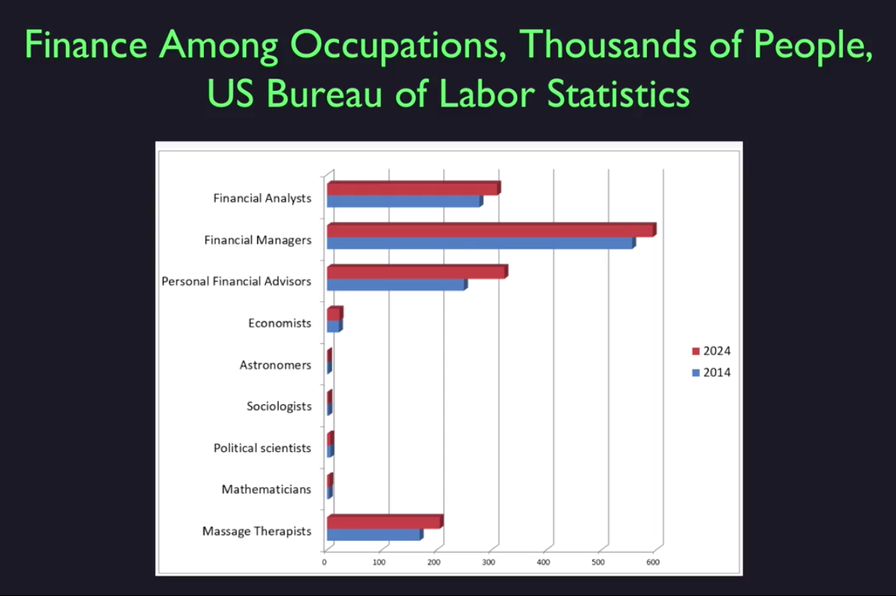

## Answers for Quiz of Lesson 1
#### Question 1:
Which of the following professions has the highest projected employment for 2024?  
- [ ] Economist
- [X] Financial Advisor
- [ ] Truck driver
- [ ] Teacher

<strong>Reason</strong>
In the Introduction video this slide was which stated **finantial management** as highest projected employed which 
is referred to US Bueau of Labor Statistics.  

